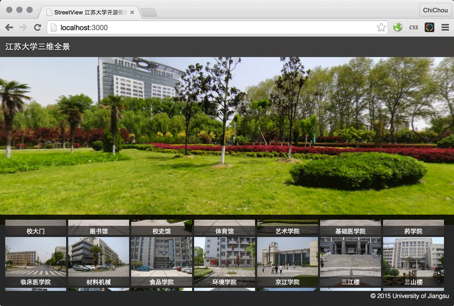

StreetView 三维全景
===

这是一个基于 [THREE.js](http://threejs.org/) 的仿 Google 街景程序，需要浏览器和显卡支持 WebGL。

本程序源代码（不包含例子中的全景图片）基于 MIT 协议许可发布。

本地测试
---

**由于浏览器的安全策略，本地（网址为file:///）上不能加载图片纹理。**直接双击打开 index.html 将无法正常显示。修改测试阶段，您可以通过以下三种方式的任意一种运行 http 服务查看效果。

### Apache / IIS / nginX 等常规 HTTP 服务器

将 src 目录使用 HTTP 服务器发布即可查看。缺点：配置较为麻烦，不支持保存刷新（livereload）。

### 使用 node 服务器（推荐）

运行测试环境需要 [node.js](http://nodejs.org/) 或兼容的 [io.js](https://iojs.org/)，以及包管理 [npm](https://www.npmjs.com/)。

### python 的 SimpleHTTPServer

python 2.x: `python -m SimpleHTTPServer`

python 3.x: `python -m http.server`

缺点：单线程 http 服务器，性能最差，也不支持 livereload。

图片规格
---

场景图片可以使用 [Photosynth](https://photosynth.net/) 等应用或者借助专业摄影器材。若要达到最佳效果（全视角），需要满足宽高比为 2:1。如长宽比大于2，会有无法呈现的视角（显示为黑色的洞）。

兼容性
---

* 支持 PC 端（包括 Mac, Linux 和 Windows 平台）最新版 Chrome / Opera / Firefox 和 IE11；
* 支持 iOS 设备；
* 支持 MIUI；
* 大部分 Android 设备不支持 WEBGL。

版权声明
---
例子中使用的全景图片均来自[江苏大学官方网站](http://www.ujs.edu.cn/swqj/)，版权归原作者所有，请勿用于商业用途。
