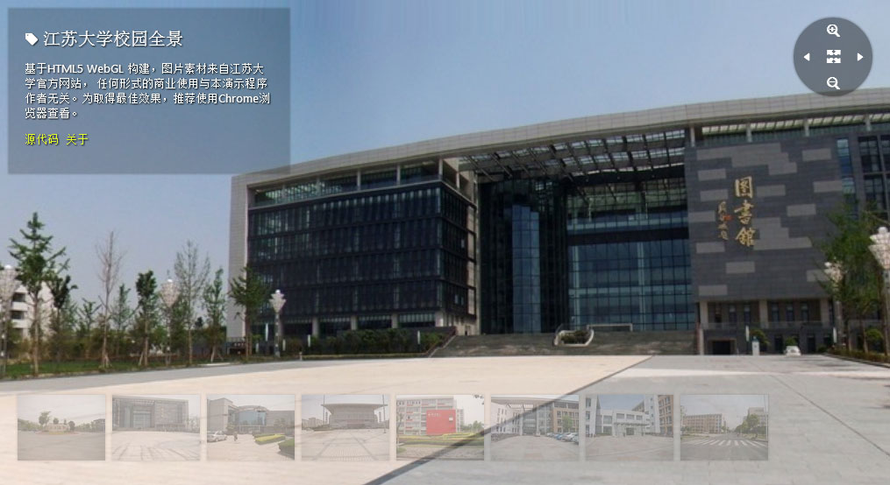

UJSCampusView - 江大街景
===

这是一个基于 [THREE.js](http://threejs.org/) 的仿 Google 街景程序，需要浏览器和显卡支持 WebGL。

[在线演示](http://chichou.github.io/UJSCampusView/demo "Live demo")

本地测试服务器
---

**由于浏览器的安全策略，本地（网址为file:///）上不能加载图片纹理。**直接双击打开 index.html 将无法正常显示。您可以通过以下三种方式的任意一种运行 http 服务查看效果。

### 使用 node 服务器（推荐）

运行测试环境需要 [node.js](http://nodejs.org/) 或兼容的 [io.js](https://iojs.org/)，以及包管理 [npm](https://www.npmjs.com/)。

### Apache / IIS / nginX 等常规 HTTP 服务器

将 src 目录使用 HTTP 服务器发布即可查看。缺点：配置较为麻烦，不支持保存刷新（livereload）。

### python 的 SimpleHTTPServer

python 2.x: `python -m SimpleHTTPServer`
python 3.x: `python -m http.server`

缺点：单线程 http 服务器，性能最差，也不支持 livereload。

图片规格
---

场景图片可以使用 [Photosynth](https://photosynth.net/) 等应用或者借助专业设备拍摄。若要达到最佳效果（全视角），需要满足宽高比为 2:1。如长宽比大于2，会有无法呈现的视角。

浏览器要求
---

目前最新版Chrome，Opera，Firefox 和 IE11 都支持 WEBGL。对于低版本的浏览器嘛，为了保证自己的体验，还是赶紧升级吧！

交互
---

* 支持键盘方向键（上下左右）导航
* 支持鼠标拖动视角
* 支持鼠标滚轮放大/缩小
* 支持按钮点击控制视角

编程接口
---

###构造器 Street(param)

需要使用 street 函数。param为视图所在的容器元素，支持id、选择器、元素三种类型。

    var streetView = street('viewport').view('img/scene.jpg');

### 切换贴图 toggle(path)

toggle方法

`streetView.toggle('img/new/path/to/texture.jpg')`

* 镜头
    * 拉近 `streetView.zoomIn()`
    * 拉远 `streetView.zoomOut()`
    * 左移 `streetView.panLeft()`
    * 右移 `streetView.panRight()`

### 事件处理

使用 `streetView.on('event', function(){/* handler here */})` 附加事件监听函数。如果第二个参数为空，则清空当前的事件回调。

* `onImageLoad` 纹理图片开始下载
* `onImageLoadFinished` 纹理图片下载完成
* `onImageDrawFinished` 纹理图片渲染完成
* `onImageLoadError` 图片下载失败

### 已知问题

在部分浏览器中无法显示图片纹理